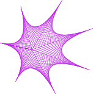

# プログラミング環境「らららプログラミング」




## 概要

「らららプログラミング」は、2次元の幾何学模様のグラフィックスを生成することができるビジュアルプログラミング環境です。

作成した模様は以下の形式のファイルとして出力することができます。
- SVG(Scalable Vector Graphics)形式
- PNG(Portable Network Graphics)形式
- 連番PNG (複数のPNGファイルの出力)

SVG形式のファイルは、Webブラウザにドラッグ&ドロップして表示することや、InkScapeに読み込んでPDF(Portable Document Format)形式に変換することができます。

## 導入方法

### 前提とする環境・ソフトウェア

Windows PC と PCにソフトウェアをインストールできる権限が必要です。
以下に前提とするソフトウェアを記載します。
( また、 [ここ](./doc/more.md) に「なくても大丈夫だけど、あるとさらに良い」という位置づけのソフトウェアを記載します。 )

#### OS

Windows 10環境で動作確認をしています。
メモリ8GBの環境で確認しています(メモリ4GBでの動作確認はしていません)。

Ubuntu 等でも動かせるようになるかもしれませんが、動作確認をしていません。

#### 画面の解像度

1920×1080 (FHD) 以上の解像度を想定しています。

#### Java

Javaの実行環境が必要です。
無料で使える OpenJDK の Microsoft Build がいいと思います。

https://learn.microsoft.com/ja-jp/java/openjdk/download#openjdk-21

#### フォント
BIZ UDGothic をインストールしてください。

https://fonts.google.com/specimen/BIZ+UDGothic

### インストール (アンインストール)
以下のファイルをダウンロードし、適当なフォルダに保存します(アンインストールする場合は、ファイルを削除します)。

lalala.jar

[ここ](./jar/lalala.jar) からダウンロードできます。

**ご注意**

上記リンクをクリックして、リンク先のページの「Download raw file」のアイコンからダウンロードします。
誤ってhtmlを保存してしまわないよう注意してください。
ダウンロードされるファイルは約8MBです。

## 使用方法

いくつかサンプルを作成しています。
サンプルフォルダ [sample](./sample/) のファイルをダウンロードし、サンプルプログラムを動かしてみます。

なお、「らららプログラミング」の細かい仕様を [ここ](./doc/specification.md) に、少し記述しています(追記中の状態です)。

### 起動

Windows の場合はエクスプローラーから lalala.jar をダブルクリック、または以下のコマンドラインで起動します。

```
java -jar lalala.jar
```

")

### サンプルを動かしてみる

ダウンロードしたサンプルフォルダ [sample](./sample/) のファイルを、エディタにドラッグ&ドロップします。
以下はサンプル 01_draw_regular_polygon.txt を読み込んだ状態です。

")

### 実行する

プルダウンメニューから実行を選びます。

")

実行すると以下のようなウィンドウが表示されます。

")

- 「パラメーターの指定」では、パラーメーターの値を変更します。
- 「グラフィックの出力」では、グラフィックの描画結果が表示されます。
- 「テキストの出力」では、テキストの出力があれば表示されます。

パラメーターを変えると、グラフィックの出力に反映されます。

また、「グラフィックの出力」のメニューから画像ファイルを保存できます。

")

### 終了

編集ウィンドウの終了メニュー、または、ウィンドウタイトルバーの閉じる(×) ボタンで、「らららプログラミング」は終了します。

")

# セキュリティ関連

セキュリティ関連の覚え書きです。

## Java について

[Java](https://ja.wikipedia.org/wiki/Java) は、かつて米国のサン・マイクロシステムズ社によって開発されたプログラミング言語・実行環境です。
現在は、オラクル社が版権を所有します。

Javaの環境自体のセキュリティは、Java実行環境の配布元によって担保されます。

## 「らららプログラミング」について

「らららプログラミング」について、セキュリティに関連しそうな事柄を以下にメモします。

( 要約: ユーザー操作の延長でのファイルの入出力のみ行い、それ以外のセキュリティリスクに関連するような処理はソフトウェアに含みません)

- インストーラーを持ちません
- 実行プログラムは、Windowsレジストリへのアクセスを行いません
- 権限昇格関係のAPIを使用しません
- 「らららプログラミング」は、ユーザー操作による入出力時にファイルへのアクセスを行います。
    - プログラムが記述されたファイルの読み取り
    - 画像ファイルの出力
- 現時点で、ダイヤグラムでプログラミングされたプログラミング言語の中から、以下を呼び出すことはできません(機能を作成してません)。
    - ファイルの入出力(ストレージへのアクセス)
    - ネットワークへのアクセス

# ライセンス
## アイコン
© copyright interactivemania 2010-2011
Default Icon by interactivemania is licensed under a Creative Commons Attribution-No Derivative Works 3.0

本ソフトウェアは、アイコンとして interactivemania による defaultIcon ( http://www.defaulticon.com/ )を使用しています。
このアイコン部分のライセンスは Creative Commons Attribution-No Derivative Works 3.0 です。

## アイコン以外

© copyright NOVISOFTWARE (japan) 2024

アイコン以外の部分のライセンスは Apache License 2.0 です。

## 生成された画像

生成された画像の著作権は、(著作権が主張できるようなものであれば)生成した人のものです。

(本ソフトウェアや、本ソフトウェアの作者は、ユーザーが生成した画像について何の権利も主張しません)

