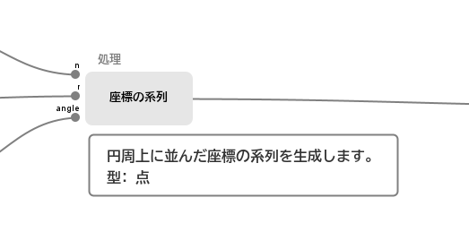
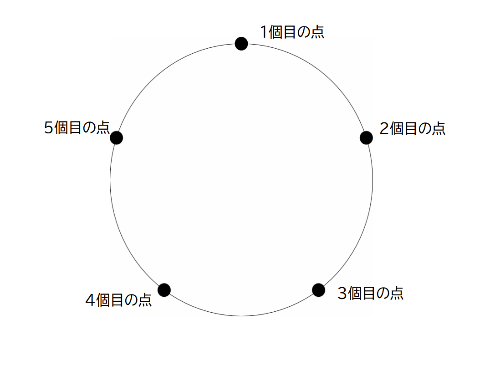

# 点の系列(座標の系列)を生成する

## 円周上に点を配置する

円周上に点を配置します。

パラーメーターにより生成される系列が変化します。

- n 分割数
- r 半径
- angle 角度

配置する点は、時計でいう12時の位置から開始します。
角度を指定することで、開始する点の位置を回転させることができます。
角度は時計回りに指定し、360で一周します。

たとえば、この点の系列を線分でつなぐことで、正多角形を描画することができます。

## 円周上に点を配置する(周回)

円周上に点を配置します。
指定された回数の周回を行います。

")

