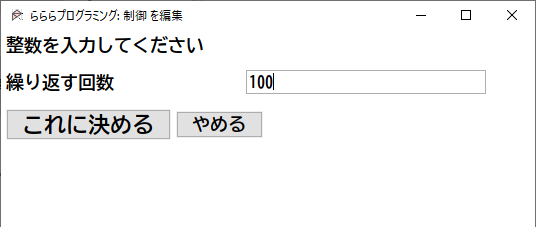

# サンプルプログラム(図形描画編)

ここではチュートリアルを兼ね、図形描画用のサンプルプログラムについて説明をしていきます。
(図形は一度inkscapeに読み込み保存し直したものを貼り付けています)

「らららプログラミング」では多角形などの点の並びを生成し、組み合わせや変形をしながら図形を作成していきます。

## 正多角形を描画する

- 01_draw_regular_polygon.txt では、正多角形を線分で描画します。
- 02_fill_regular_polygon.txt では、正多角形を塗りつぶします。

##### プログラム(線分で描画)

プログラムの画面キャプチャを以下に示します。

大きめのフォントで表示された「1」「2」の文字は、実行順を表します。
画面上の表示位置に基づいて自動的に採番されます。
エディタ上では数字の部分をドラッグすると線でつながった一式が移動します。

下線が引かれた文字はコメントです。プログラムの処理結果に影響を与えません。

<kbd></kbd>

##### プログラム(塗りつぶし)

<kbd></kbd>

##### プログラム作成のための操作方法

「ダイヤグラムを編集」ウィンドウで左クリックすると表示される
「部品を追加」メニューから
「点の集まり - 円周上に並んだ点」を選ぶことで、
「座標の系列」アイコンを配置することができます。

この処理は円周上に並べられた点を作成するので、線分として描画すると正多角形の出来上がりです。

<kbd></kbd>

「ダイヤグラムを編集」ウィンドウで左クリックすると表示される
「部品を追加」メニューから
「点の集まり - 円周上に並んだ点」を選ぶことで、
「座標の系列」アイコンを配置することができます。

この処理は円周上に並べられた点を作成するので、線分として描画すると正多角形の出来上がりです。

また、閉じた多角形を描画する場合、「部品を追加」メニューから「出力 - 線の集まりをつないで描画(閉じる)」を選びます。

<kbd></kbd>

##### 生成される画像

以下は 01_draw_regular_polygon.txt により生成した線分での多角形の描画の出力例です。

以下は 02_fill_regular_polygon.txt により生成した多角形の塗りつぶしの出力例です。

## 星形を描画する

以下の2通りを作例として格納しています。
- 03_star_example1.txt
- 04_star_example2.txt

03_star_example1.txt では、多角形の系列の順番を入れ替えることで星形を描画しています。

04_star_example2.txt では、外側の頂点の系列と内側の頂点の系列をそれぞれ作成し、混ぜ合わせてひとつの系列にすることで星形を描画しています。

##### 生成される画像

以下は 03_star_example1.txt による出力例です。

以下は 04_star_example2.txt による出力例(1枚目)です。

以下は 04_star_example2.txt による出力例(2枚目)です。
角度に少し数字を足すことで、いびつな星形を描画することができます。

## コッホ曲線(コッホ雪片)

イニシエーターとジェネレーターの組み合わせによりフラクタル図形を生成する例です。
フラクタル図形として知られる [コッホ曲線](https://ja.wikipedia.org/wiki/%E3%82%B3%E3%83%83%E3%83%9B%E6%9B%B2%E7%B7%9A) の作図例です。

- 05_koch_curve.txt

回転をさせたり、ジェネレーターの形を変えてみることで歪ませることもできます。

## リサージュ図形

[リサージュ図形](https://ja.wikipedia.org/wiki/%E3%83%AA%E3%82%B5%E3%82%B8%E3%83%A5%E3%83%BC%E5%9B%B3%E5%BD%A2) を作成する例です。
この例では、n周する円と、m周する円を90度の角度で交わる軸に沿ってそれぞれ潰し、組み合わせることで作図を行っています。

- 06_Lissajous_figure.txt

元々のリサージュ図形から崩したバリエーションを作図することができます。

## 繰り返し図形

多角形の変換を繰り返すことによって得られる図形です。

- 08_repeat2_inkscape.svg

##### プログラム

決められた固定回数を繰り返す部品を使用しています。
多角形を作成し、変換と描画を繰り返しています。

<kbd></kbd>

繰り返し回数は、枠内の薄青色の着色部を押すと設定ウィンドウが表示されます。

<kbd></kbd>

なお、「らららプログラミング」は、以下の繰り返し構造を提供します。
- 決められた固定回数を繰り返すだけ
- 初期値、終了値、刻み幅によるループ(添字を参照可能)
- 2次元の領域を格子状に充填するループ(x, y, および変換を添字として参照可能)
- 2次元の領域をハニカム状に充填するループ(x, y, および変換を添字として参照可能)

##### 生成される画像

## ひとでみたいな形

昔よくあったような形を組み合わせたものです。

- 09_starfish.txt

## トロコイド(トロコイド風の図形)

- 10_trochoid.txt

[トロコイド](https://ja.wikipedia.org/wiki/%E3%83%88%E3%83%AD%E3%82%B3%E3%82%A4%E3%83%89) か、それに似た図形を生成します。

---------------------------------------
[README.mdに戻る](../README.md)

