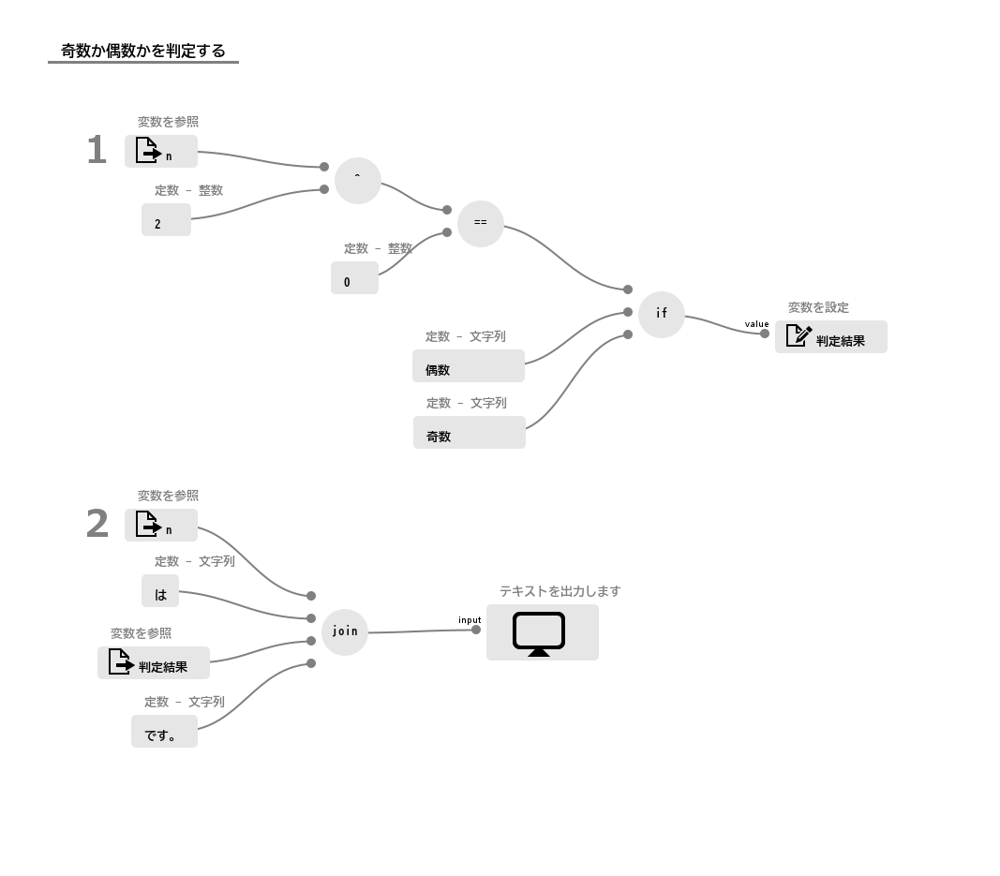
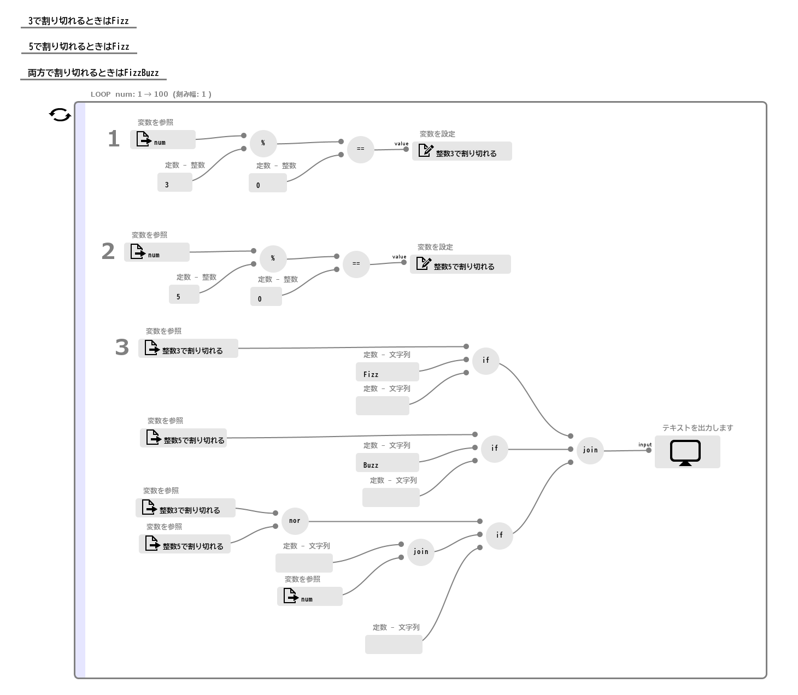
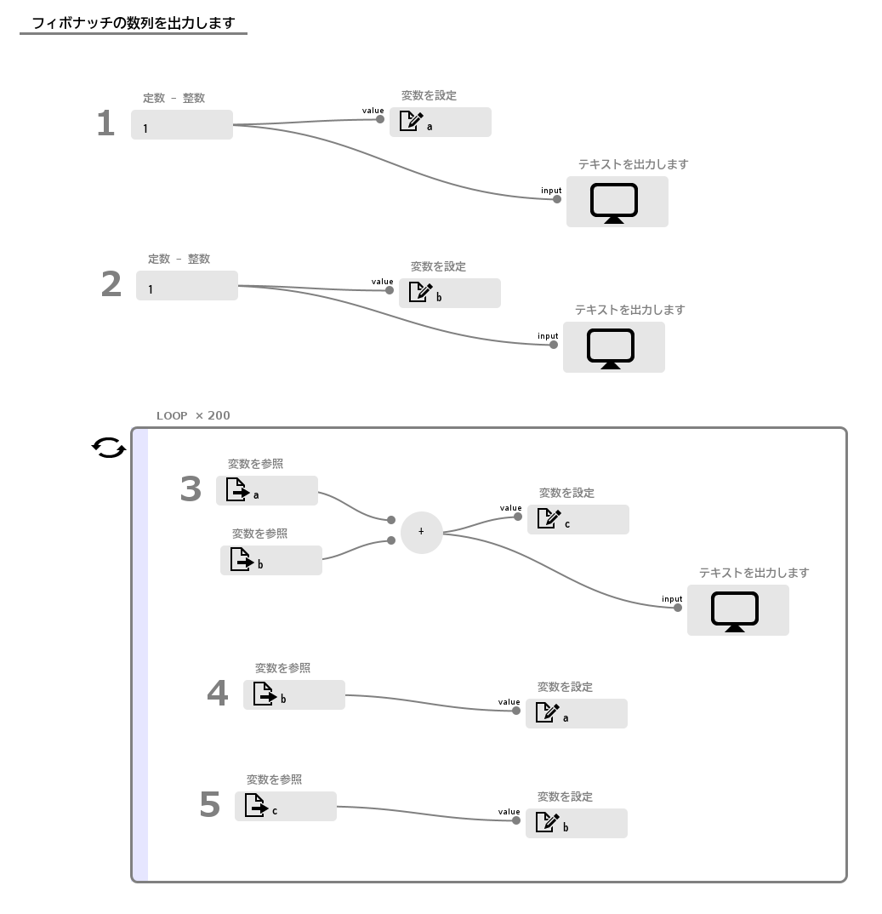

# サンプルプログラム(プログラミング編)

プログラミングの入門的な課題で、よくありそうなものについていくつか作例を格納しています。
この README の中ではプログラムの画像キャプチャも貼っています。

## Hello, World
文字列 「Hello, World!」 を出力します。

##### プログラム

<kbd></kbd>

##### 出力
```
Hello, World!
```

## 順番に増えていく整数を出力
ループの使用例です。
1から10までの整数を出力します。

##### プログラム

<kbd></kbd>

##### 出力
```
順番に増えていく整数を出力します。
1
2
3
4
5
6
7
8
9
10
```

## Even Odd
奇数(odd)か偶数(even)かを判定します。
パラメーターの使用例を兼ねています。

##### プログラム

<kbd></kbd>

##### 出力例


## FizzBuzz

[FizzBuzz](https://ja.wikipedia.org/wiki/Fizz_Buzz)についての作例です。
1から100までの整数を出力します。ただし、

- 3で割り切れるときはFizz
- 5で割り切れるときはFizz
- 両方で割り切れるときはFizzBuzz

を出力します。

##### プログラム

<kbd></kbd>

## Fibonacci sequence

[フィボナッチの数列](https://ja.wikipedia.org/wiki/%E3%83%95%E3%82%A3%E3%83%9C%E3%83%8A%E3%83%83%E3%83%81%E6%95%B0) を出力します。
多倍長整数のデモを兼ねています。

##### プログラム

<kbd></kbd>

##### 出力

```
1
1
2
(略)
280571172992510140037611932413038677189525
453973694165307953197296969697410619233826
734544867157818093234908902110449296423351
```

