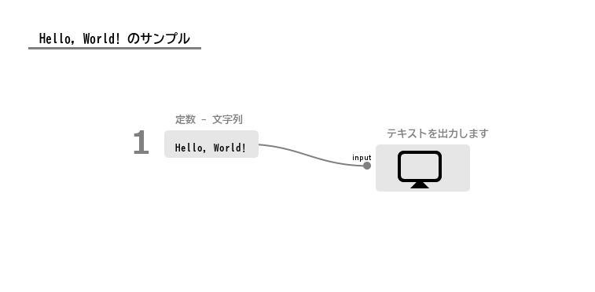
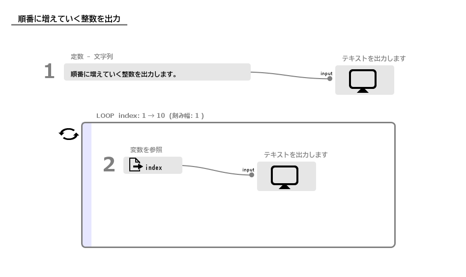

# サンプルプログラム(プログラミング編)

プログラミングの入門的な課題で、よくありそうなものについていくつか作例を格納しています。

## Hello, World
文字列 「Hello, World!」 を出力します。

##### プログラム

<kbd>

</kbd>

##### 出力
```
Hello, World!
```

## 順番に増えていく整数を出力
ループの使用例です。
1から10までの整数を出力します。

##### プログラム

<kbd>

</kbd>

##### 出力
```
順番に増えていく整数を出力します。
1
2
3
4
5
6
7
8
9
10
```

## Even Odd
奇数(odd)か偶数(even)かを判定します。

## FizzBuzz

[FizzBuzz](https://ja.wikipedia.org/wiki/Fizz_Buzz)についての作例です。
1から100までの整数を出力します。ただし、
- 3で割り切れるときはFizz
- 5で割り切れるときはFizz
- 両方で割り切れるときはFizzBuzz
を出力します。

## Fibonacci sequence

[フィボナッチの数列](https://ja.wikipedia.org/wiki/%E3%83%95%E3%82%A3%E3%83%9C%E3%83%8A%E3%83%83%E3%83%81%E6%95%B0) を出力します。


